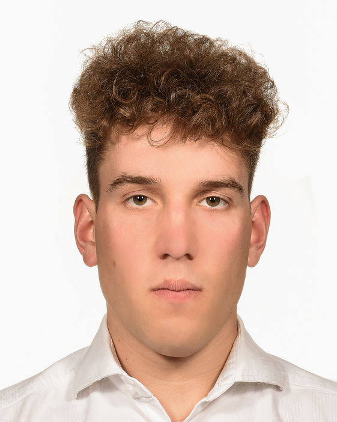

Jestem absolwentem Technikum na kierunku Mechatronika.
Pierwsze doświadczenie zdobywałem już w szkole średniej.
Swój rozwój zawodowy wiążę z Mechatroniką oraz AI

"Jedyną pewną metodą unikania porażek jest nie mieć żadnych, nowych pomysłów."  
~Albert Einstein

# Projekty
- [SafeDrive](https://youtu.be/f3RRo53PAh8)
- DigitalTwin IDS AGH

# Edukacja  

## Akademia Górniczo-Hutnicza im. Stanisława Staszica w Krakowie
- Poziom wykształcenia: Inżynier
- 10.2022 – obecnie		
- Kierunek: Informatyki i Systemów Inteligentnych

## Zespół Szkół Elektryczno-Elektronicznych im. Maksymiliana Tytusa Hubera w Szczecinie	
- Poziom wykształcenia: Technik
- 09.2018 – 04.2022
- Kierunek: Mechatronika

# Doświadczenie Zawodowe  
- 02.2021 – 03.2021		Praktyka zawodowa w firmie Marcontrel Sp. z o.o.
- 06.2020 – 07.2020		Praktyka zawodowa w firmie Puch Sp. z o.o.

# Umiejętności
- Obsługa programów EasyEDA,
- TIA Portal,
- Eagle,
- Yenka,
- Projektowanie i wykonywanie układów:
  - mechatronicznych,
  - elektrycznych,
  - elektronicznych,
  - Wykonywanie płytek PCB

# Osiągnięcia
- Tytuł **laureata** Olimpiady Innowacji Technicznych i Wynalazczości blok A – innowacje techniczne,
- Tytuł **finalisty** XLV Ogólnopolskiej Olimpiady Wiedzy Elektrycznej i Elektronicznej w grupie mechatronicznej 

# Zainteresowania
- Elektronika,
- Fotografia, 
- Sporty zimowe,
- Muzyka poważna,
- Psychologia,
- Samotne komputery w twojej okolicy

